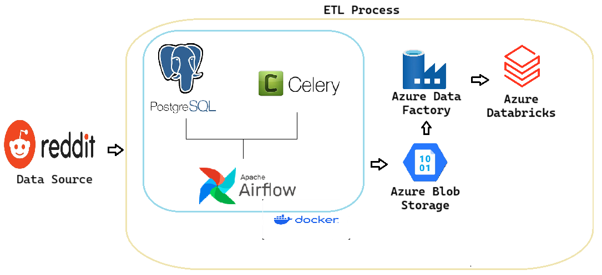

# Reddit ELT Pipeline

[](https://airflow.apache.org/docs/)
[](https://docs.celeryq.dev/en/stable/getting-started/introduction.html)
[](https://www.postgresql.org/docs/)
[](https://docs.python.org/3.11/)
[](https://spark.apache.org/docs/latest/api/python/index.html)
[](https://learn.microsoft.com/en-us/azure/storage/blobs/storage-quickstart-blobs-python?tabs=connection-string%2Croles-azure-portal%2Csign-in-azure-cli&pivots=blob-storage-quickstart-scratch)
[](https://learn.microsoft.com/en-us/azure/databricks/)
[](https://learn.microsoft.com/en-us/azure/data-factory/)

This project implements a scalable ETL (Extract, Transform, Load) pipeline for collecting, processing, and analyzing data from Reddit. The system is designed to handle large volumes of data efficiently by leveraging cloud-based storage, distributed task execution, and scalable processing.

With Apache Airflow orchestrating the workflow, the pipeline extracts data from Reddit, processes it using PostgreSQL as an intermediate storage layer. The data is then stored in Azure Blob Storage before being loaded into Azure Databricks to perform the necessary data transformations.

## Architecture


- __Reddit API__: Data source
- __Apache Airflow__: Orchestrate the ETL process.
- __Celery__: Facilitates distributed task execution, enhancing scalability and performance
- __PostgreSQL__: Temporary data storage.
- __Azure Blob Storage__: Raw data storage.
- __Azure Data Factory__: Detects change in data and triggers Databricks to be run.
- __Azure Databricks__: Perform necessary transformations on the data using PySpark.

## Setup
1. Clone the repository.
   ```bash
   git clone https://github.com/KevinJM17/Reddit-ELT-Pipeline.git
   ```
3. Create a new virtual environment and activate it.
   ```bash
   python -m venv venv
   .\venv\Scripts\activate
   ```
4. Create the configuration file `config.conf`, containing reddit api keys, azure connection keys, storage name, postgres details.
5. Build the docker container.
   ```bash
    docker compose up -d --build
   ```
6. Launch Airflow Web UI.
   ```bash
   http://localhost:8080
   ```
